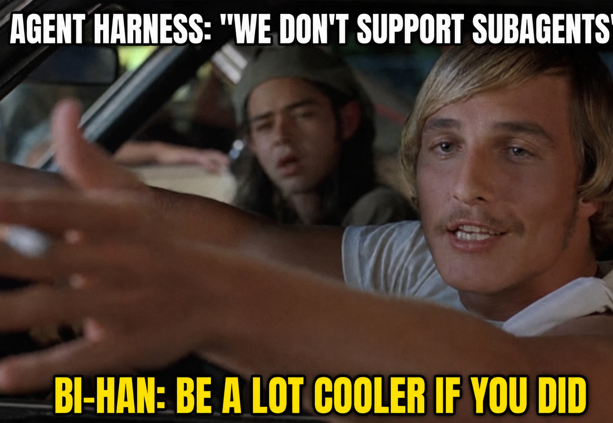
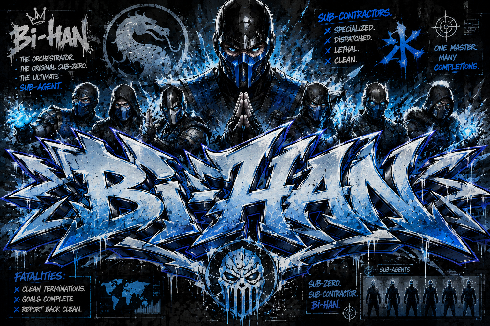

# BiHan.

<p align="center">
  
</p> 

[](https://www.npmjs.com/package/@genoventures-labs/bihan)
[](https://www.npmjs.com/package/@genoventures-labs/bihan)
[](https://nodejs.org/)
[](https://www.npmjs.com/package/modelhitch)
[](#)

> Specialized subagent orchestration for models that need to get real work done with an abundance of tools.

---

## The Name

In Mortal Kombat lore, **Bi-Han** was the original Sub-Zero before becoming Noob Saibot. He was the lethal Lin Kuei warrior dispatched on precision missions behind enemy lines.

Here, **Bi-Han** is your Grandmaster orchestrator, and your subagents are **Sub-contractors** (or sub-zeros). 

Instead of crowding a single model with dozens of tools, instructions, and messy scratch work, the Grandmaster hires targeted sub-contractors, gives them an arsenal of tools to finish a specific job, and gets back a clean, finished result.

No bloated context. No tool confusion. Just cold, calculated execution.

---

## Why bihan?

<p align="center">
  
</p>
Most agent setups break down once you give them too many tools. The prompt fills up with tool schemas, raw logs, and intermediate errors until the model loses track of the goal.

bihan solves this by providing:

- **Sub-contractor Delegation:** Parent agents spin up specialized subagents that tackle complex tasks in their own isolated loops.
- **Clean Contexts:** The orchestrator only receives the final synthesized answer from each subagent, keeping its own thought process sharp and uncluttered.
- **Abundant Toolsets:** Give your agents full access to workspaces, terminal commands, scratchpad memories, and custom APIs without slowing down the primary conversation.
- **ModelHitch Engine:** Built directly on top of ModelHitch for multi-provider failover, local/cloud routing, and reliable tool loops.

---

## Installation

```bash
npm install @genoventures-labs/bihan modelhitch zod
```

---

## Quick Start

```typescript
import { Bihan, defineTool, tools } from "@genoventures-labs/bihan";
import { z } from "zod";

// 1. Initialize the Grandmaster
const bihan = new Bihan({
  defaultModel: "openrouter/anthropic/claude-3.5-sonnet",
  maxSubagentDepth: 3,
});

// 2. Prepare tools
const [readFile, writeFile, listFiles] = tools.createFileSystemToolkit();

const runAudit = defineTool({
  name: "run_audit",
  description: "Scan files and return security score",
  parameters: z.object({
    directory: z.string().describe("Directory to inspect"),
  }),
  execute: async ({ directory }) => {
    return { status: "clean", checked: directory, issues: 0 };
  },
});

// 3. Register your Sub-contractor
bihan.registerAgent({
  name: "CodeAuditor",
  role: "Security & Code Inspector",
  instructions: "Review requested project directories and provide clear summaries.",
  tools: [runAudit, readFile, listFiles],
});

// 4. Dispatch the mission
async function main() {
  const result = await bihan.runTask(
    "Check the src folder and give me a quick health check."
  );

  console.log("Report:", result.content);
}

main();
```

---

## Builtin Toolkits

bihan includes ready-to-use toolsets out of the box:

- **FileSystem:** `read_file`, `write_file`, `list_files`
- **Shell:** `run_command`
- **Memory Scratchpad:** `save_memory`, `get_memory`, `list_memory_keys`
- **Icebox (Shared State Bus):** `icebox_freeze`, `icebox_thaw`, `icebox_list`

---

## Icebox (Shared State Bus)

When Subagent A generates large data (e.g. 50KB AST, raw database records, or full source files), passing it back through LLM prompt messages wastes context and tokens.

Instead, subagents freeze large objects into the shared `icebox`:

```typescript
// Subagent 1 can freeze data:
bihan.icebox.freeze("parsed_ast", largeAstPayload, { frozenBy: "CodeScanner" });

// Subagent 2 thaws it directly without bloating prompt tokens:
const ast = bihan.icebox.thaw("parsed_ast");
```

---

## ModelHitch Lane Presets

Different subagents have different speed, cost, and intelligence needs. Route them instantly using lane presets:

```typescript
const bihan = new Bihan({
  lanePresets: {
    fast: "groq/llama-3.3-70b-versatile",
    reasoning: "openrouter/anthropic/claude-3.5-sonnet",
    local: "ollama/qwen2.5-coder:14b",
  },
});

// Runs on lightning-fast Groq
bihan.registerAgent({
  name: "FileHunter",
  lane: "fast",
  instructions: "Quickly locate files matching patterns.",
});

// Runs air-gapped on local Ollama
bihan.registerAgent({
  name: "InternalAuditor",
  lane: "local",
  instructions: "Analyze confidential business logic.",
});
```

---

## Strict Structured Outputs (Fatalities)

Enforce guaranteed JSON outputs matching any Zod schema with `.runStructured()`:

```typescript
const ReviewSchema = z.object({
  score: z.number().min(0).max(100),
  approved: z.boolean(),
  criticalIssues: z.array(z.string()),
});

const { data } = await reviewerAgent.runStructured(
  "Review the auth implementation",
  ReviewSchema
);

// Fully typed result:
console.log(data.score, data.approved);
```

---

## Lifecycle Events

Track agent operations in real-time for logging or user interfaces:

```typescript
bihan.on("subagent_dispatched", ({ caller, target, depth }) => {
  console.log(`[Dispatched] ${caller} -> ${target} (Level ${depth})`);
});

bihan.on("tool_call", ({ agent, tool }) => {
  console.log(`[Tool Call] ${agent} invoked ${tool}`);
});

bihan.on("subagent_completed", ({ target, turns }) => {
  console.log(`[Completed] ${target} finished in ${turns} turns`);
});
```

---

## Bring Your Own Inference (AGY, OpenAI, or In-House Gateways)

ModelHitch is the default zero-config inference engine, but you are never locked in. If you already use Google Antigravity (AGY), raw OpenAI/Anthropic SDKs, or an internal corporate LLM gateway, plug it directly into `bihan`:

```typescript
const bihan = new Bihan({
  inference: async ({ messages, tools, model }) => {
    // Route to AGY, Vertex AI, or your custom gateway
    const res = await myCustomGateway.chat({
      messages,
      tools,
      model,
    });

    return {
      content: res.text,
      toolCalls: res.toolCalls, // [{ id, name, arguments }]
      usage: res.usage,
    };
  },
});
```

You can even assign custom inference engines on a **per-agent** basis (e.g. Grandmaster on AGY/Frontier, Sub-contractor on local Ollama):

```typescript
bihan.registerAgent({
  name: "InternalBot",
  inference: customLocalEngine,
});
```

---

## Model Context Protocol (MCP) Bridge

Give your sub-contractors instant access to the entire ecosystem of MCP servers (GitHub, PostgreSQL, SQLite, Playwright, Filesystem, Brave Search, etc.) via stdio or SSE:

```typescript
// Connect to any external MCP server via stdio:
const githubMcp = await bihan.importMcpStdio({
  command: "npx",
  args: ["-y", "@modelcontextprotocol/server-github"],
  env: { GITHUB_PERSONAL_ACCESS_TOKEN: process.env.GITHUB_TOKEN! },
});

// Or connect via SSE:
// const sseMcp = await bihan.importMcpSse({ url: "http://localhost:8080/sse" });

// Assign imported MCP tools directly to specialized sub-contractors:
bihan.registerAgent({
  name: "PRInspector",
  role: "GitHub Pull Request Reviewer",
  instructions: "Review recent pull requests and post constructive feedback.",
  tools: githubMcp.tools,
});
```

---

---

## Native Extensions: Gemini / AGY & OpenAI / Codex

Bi-Han provides first-class native plugins and skills:

- **Gemini / Antigravity (AGY):** Pre-packaged in `.agents/plugins/bihan/` with `plugin.json`, `mcp_config.json`, and `rules/AGENTS.md`.
- **OpenAI / Codex:** Pre-packaged in `.codex/skills/bihan-orchestrator/` for native Codex execution.

### Compatibility Layer for Other Harnesses

If you use an existing framework or custom script that never implemented subagents, `bihan` acts as a drop-in subagent adapter. To an external harness, a subagent looks like a standard function tool:

```typescript
// Export subagents as OpenAI-compatible tools
const externalTools = bihan.toTools("openai");

// Or export as Anthropic-compatible tools
const anthropicTools = bihan.toTools("anthropic");

// Pass them directly into your existing harness:
const response = await openai.chat.completions.create({
  model: "gpt-4o",
  messages: [...],
  tools: [...myRegularTools, ...externalTools],
});

// When your harness receives a tool call for the subagent:
if (call.function.name.startsWith("invoke_")) {
  const result = await bihan.dispatch(call.function.name, call.function.arguments);
  // Send result back to your external harness as a standard tool response!
}
```

---

## Architecture

- **Grandmaster (`Bihan`)**: High-level planner and orchestrator.
- **Sub-Contractors (`Subagents`)**: Targeted agents dispatched with specialized toolkits to execute discrete missions.
- **Abundant Tooling**: Deep tool catalogs without context bloat.

---

## License

MIT
